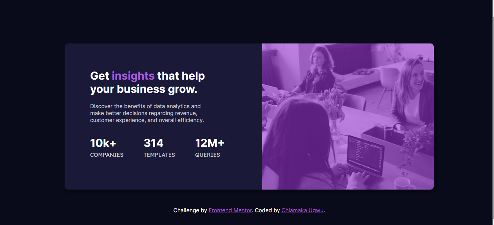

# Frontend Mentor - Stats preview card component solution

This is a solution to the [Stats preview card component challenge on Frontend Mentor](https://www.frontendmentor.io/challenges/stats-preview-card-component-8JqbgoU62). Frontend Mentor challenges help you improve your coding skills by building realistic projects. 

## Table of contents

- [Overview](#overview)
  - [Screenshot](#screenshot)
  - [Links](#links)
  - [Built with](#built-with)
  - [What I learned](#what-i-learned)
- [Author](#author)

## Overview

### Screenshot

### Links

- Live Site URL: [Add live site URL here](https://your-live-site-url.com)

### Built with

- Semantic HTML5 markup
- CSS custom properties

### What I learned
I found easier ways to center the image and opaque color together to acheive better results. I'm also perfecting my skills towards responsiveness. I used the "column-reverse" value of the "flex-direction" property for the first time and I'm glad I was able to achieve desired results.

## Author

- Frontend Mentor - [@chiamaka-ugwu](https://www.frontendmentor.io/profile/chiamaka-ugwu)
- Twitter - [@chiamakaugwu_](https://www.twitter.com/chiamakaugwu_)
